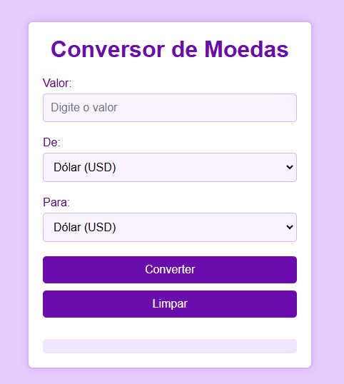
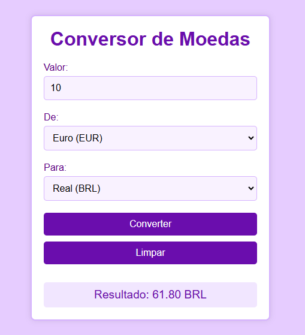

# Conversor de Moedas.

## Começando 🚀
Nesse projeto, foi criada um Conversor de Moedas na seguinte matéria:
* Programação Web I.

## Sobre o projeto 📋
Este projeto é um conversor de moedas simples. Ele permite que o usuário insira um valor e selecione a moeda de origem e a moeda de destino para realizar a conversão. 

## Técnicas e Tecnologias utilizadas 🔨
* Visual Studio Code.
* Git Bash.
* Git Hub.
* HTML5.
* CSS3.
* JavaScript Puro.
* Live Server (A extensão Live Server permite criar um servidor local através do VSCode. Com ele é cortado a necessidade de sempre que fizer uma alteração no código atualizar o navegador).

## Foto do projeto.

  Essa é a tela do conversor.

## Autores ✍🏻
| [ Larissa Gabrielle Fagundes Andrade.](https://github.com/gabriellefagundes) |
| :---: 
## Meu LinkedIn:
|  [ LinkedIn.](https://www.linkedin.com/in/larissa-gabrielle-a74a272b3/)
| :---: 